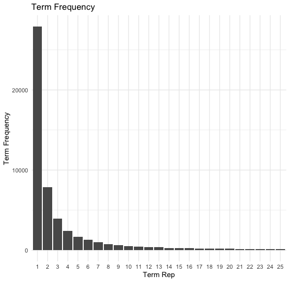
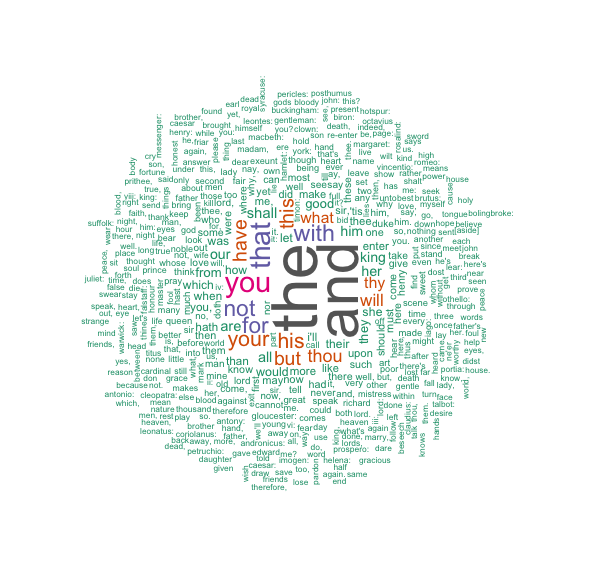
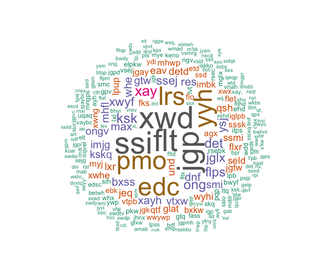
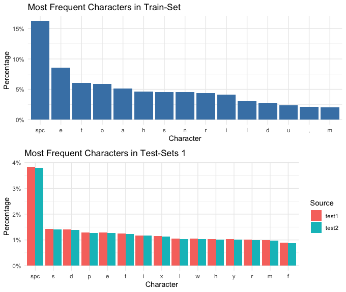
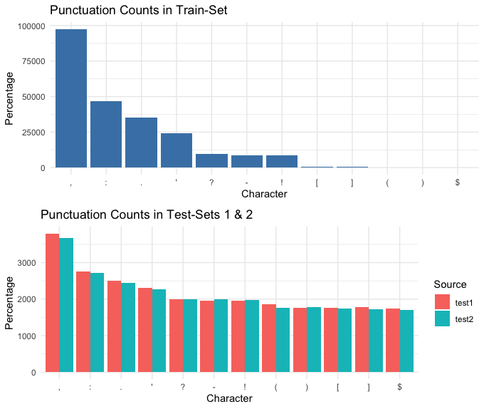
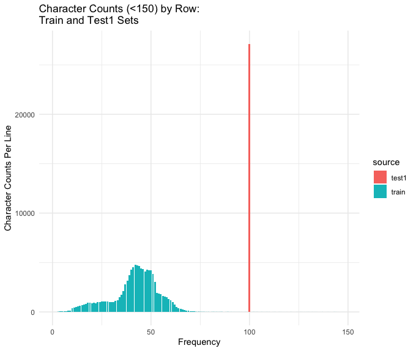
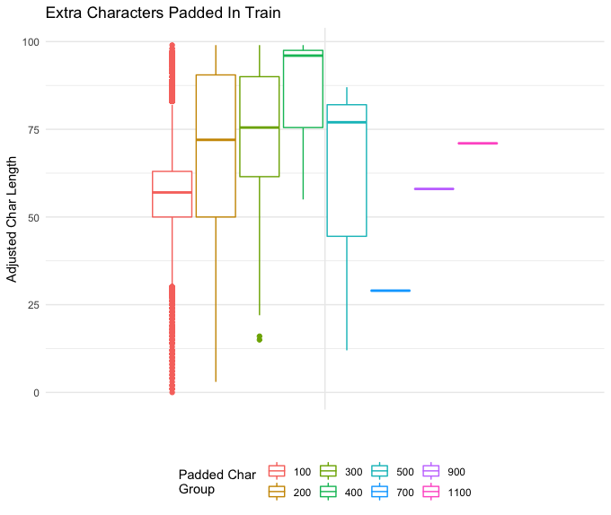

## The Data: 
The data sets that will be used are provided by Kaggle for the closed “Cipher Challenge III” competition. The challenge contained two data sets:  a plain text training set and a ciphertext testing set. The plain text set included 108,755 lines of Shakespeare’s plays. The ciphertext set consisted of 108,755 corresponding lines; however, each line was encrypted with a possible, four layers, of known cipher techniques. For this project, I will focus only on the single-layered ciphertext (level 1) with a stretch goal of attempting an additional layer if the models proved to be successful. 

These data sets were specifically chosen due to the Shakespearean plain text. Homomorphic encryption allows for the use of encrypted data without the need to unencrypt it, and Shakespeare’s Old English prose can be viewed as a type of encryption when compared to modern English (to a small degree). Therefore, the use of this text provides an “entry-level” step into machine learning using already encrypted data. Again, if successful, including the second later encrypted data could further show machine learning’s ability to recognize patterns in known data. 

While the lines of Shakespeare text vary in length, the ciphertext contained alpha-numeric "padding" to increase each sentence/line length to the next 100 characters. This padding introduces a random element that I will need to account for. 

The Cipher text Challenge III data can be found: https://www.kaggle.com/kaggleuser58/cipher-challenge-iii-level-1/data

The data exploration code performed in R: https://github.com/ckornafel/cipherproject/blob/master/code/Ciphertext_Data_Prep.R

Additional functions: https://github.com/ckornafel/cipherproject/blob/master/code/C_Functions.R


## Text Cleaning
Typically, several text "cleaning" techniques would be applied to the text prior to exploring to focus attention only on key elements. Cleaning would include the removal of punctuation, stop words, and capitalization (among other processes). However, since each character (including capitals, punctuation, etc.) may represent a crucial pattern in the encrypted text (e.g. an "a" may be translated to a "!") no cleaning will be performed. Additionally, the removal of stop words (typically the most frequent) could reduce the size of potential patterns within the text data, complicating the training/prediction process. 

# Loading and Exploring the Data
Due to the "closed" status of the Kaggle Challenge and the possibility that the data would become unobtainable, copies of each data set was added to the Git Repository. 

```{r include=FALSE}
library(readr)
library(stringr)  #String Manipulation Functions
library(tm) #Corpus Functions
library(wordcloud) #For Wordcloud Graphic/Plot
library(ggplot2) #Plotting Functions
library(plyr) #Functional Shortcuts
library(dplyr) #Load after plyr to prioritize on stack for speed of functions
library(gridExtra) #Display multiple ggplot on a single page
```

# Loading the Data
```{r}
#Loading the Data 
##Datasets have been copied to the website
train <- read.csv("https://raw.githubusercontent.com/ckornafel/cyphertext/master/ciphertext-challenge-iii/train.csv",
                 stringsAsFactors = FALSE)
test <- read.csv("https://github.com/ckornafel/cyphertext/raw/master/ciphertext-challenge-iii/test.csv",
                 stringsAsFactors = FALSE)

```

# Plain text Data set
I am expecting to see three columns: An ID, Plain text, and an Index Value
```{r}
head(train[order(train$index),],5)
```

As expected, the training data set contains three columns, the plain text id, the Shakespearean plain text, and the index key. 
The plain text sample shows that each line/row of text could be partial examples of play lines, including randomly included titles. It does appear that some of the text can be grouped by certain whole Shakespearean works (King Henry) and broken out by scene line.
Since the first part of King Henry IV contains 33 lines, I wanted to know what the next block of text might include. 

```{r}
train[which(train$index > 33 & train$index < 39),]
```

Westmoreland is the next section of King Henry IV after King Henry's part (scene I) - it appears that the plain text is organized as multiple plays and each line represents one line of plain text. 
```{r}
length(unique(train$text))
```

108755 unique lines of text matches that total number of rows in the training data set. Therefore, it signifies that there are no repeated lines which
could complicate dicphering the cyphertext, given that there are multiple ciphers applied to the entire set. 

# Cipher text 
```{r}
str(test)
```

The test (cyphertext) data set also contains three variables: ciphertext id, ciphertext, and difficulty. The difficulty value indicates the number
of ciphers used on the plain text. E.g. level one indicates that a single cipher was applied, level two indicates that an additional cipher was applied
to the first ciphertext, etc. 

# Splitting the Test Data set into Four Levels
```{r}
test1<- test[test$difficulty==1,]
test2<- test[test$difficulty==2,]
test3<- test[test$difficulty==3,]
test4<- test[test$difficulty==4,]
rm(test) #Conserving memory
head(test1$ciphertext) #Viewing the Level 1 CipherText
```

## Terms/Words
Both data sets contained lines of text (sentences) which could be broken down into smaller text-items. For the next part, I will be focusing on the words/terms which comprise each of the text lines. Perhaps there may be some pattern that I can use to create numeric vectors for the machine learning algorithms. 

```{r trainltrfreq, echo=FALSE,  out.width = '70%'}

```

It appears that there are only a small subset of terms (approx 7) which appear with high frequency. One term appears over 25,000 times
but the next most frequent term drops to below 10,000 occurrences in the complete Shakespearean text. 
There are 27937 terms that appear only once in the Shakespeare text. This highlights that slightly more than half (51.33%) of the entire
set of terms are unique combinations of letters/punctuation. 

# Most Frequent Terms in the Train (Plain text) Set
```{r trainwd, echo=FALSE, out.width = '90%'}

```

The most frequent Shakespeare terms are similar to those found in modern English (e.g. and, the, not, etc.). Normally, in text mining exercises, 
these common (stop) words would be removed in order to focus on the more impactful words in the corpus. However, since I am working with cyphertext
every word (and punctuation) could be represented in the ciphertext and therefore needs to remain in the plain text. 

# Most Frequent Terms in the Test (Cipher text) Set
```{r testwd, echo=FALSE,  out.width = '90%'}

```

The most frequent terms in the test1 data set appear to be similar in length (short) to the plain text frequent words. Although, there seem to a few words (e.g. xwd, ssiflt) that have much more frequency. This is because the training set is only a quarter of the size of the training set. There are no terms in test 3 which appear only once. The lowest frequency of occurrence are two terms which appear twice and three times in the cipher text. Given the large volume of individual number combinations, it may indicate that they represent letter pairs or phonetic sounds instead of whole terms. 

# Comparing Word Frequency between Train and Test
```{r}
WordCount <- function(x){
  return(length(unlist(strsplit(as.character(x), "\\W+"))))
  
}
train$num_term<-sapply(train$text, WordCount)
table(train$num_term)

test1$num_term<-sapply(test1$ciphertext, WordCount)
table(test1$num_term)
```

It does not appear that the count of terms for each section of Shakespeare Text correlates well with the count of terms from 
each of the cipher texts. Those term counts that do align (e.g. one instance of a 49-term length Shakespeare text) also appear in
multiple cipher texts (e.g one instance of a 49-term Test 1 text and one instance of a 49-term Test 2 text). Given the assumption 
that there is no overlap of cipher to plain texts, it would appear that spaces may not term separators in the cipher texts. 

Additionally, there are 416 instances of a single-term Shakespeare text but the smallest number of cipher text terms is seven in 
both test1 and test2 sets. Either these single-term texts are hidden in test3 and test4, or another indication that spaces are not
term separators in the cipher texts. 

# Groups of Terms
```{r}
term_freq <- train %>%
  group_by(num_term) %>%
  summarise(counts = n())

ggplot(head(term_freq,20), aes(x=num_term, y = counts ))+
  geom_bar(fill = "steelblue", stat = "identity")+
  theme_minimal()
```

It looks like the training set is mainly comprised of short (<15) worded terms. However, given that this set represents all four cipher levels and we are only focusing on one, the actual distribution of the reduced set may be smaller. 

## Characters 
While the above section explored the individual words/terms within each line of text. This next section will dive into the individual characters which make-up those words/terms. 

A quick check to verify that the same characters are used for train and test1
```{r}
all_text_train <- paste(train$text, collapse= "")
all_text_test1 <- paste(test1$ciphertext, collapse = "")
uniq_chr_train <-as.vector(unique(strsplit(all_text_train, "")[[1]]))
uniq_chr_test1 <-as.vector(unique(strsplit(all_text_test1, "")[[1]]))

sort(uniq_chr_train) == sort(uniq_chr_train)
sort(uniq_chr_train) == sort(uniq_chr_test1)
```

It is known that the plain text and ciphertext did not contain any unique characters and were comprised of alpha letters (upper/lower case), punctuation, and spaces. This confirms that the two data sets did not include characters that were not also used in the other. Hopefully this will make it easier for the machine learning models to identify patterns. 

```{r ltrcomp, echo=FALSE, out.width = '90%'}

```

The comparison of the characters highlights a potential substitution cipher being used. I've included the second layered ciphertext set for comparison. According to this chart, it could be assumed that the space character is not changed when encrypted. This means that individual words have the same separator (space) after encryption. Additionally, this plot could identify that all plain text e's are exchanged for ciphertext s's. 
Another possible assumption could be made between the level 1 and 2 encryption since the character frequencies are so similar. This could indicate that they are similar cipher techniques but with different rotating letters. 
It is also noted that punctuation does not appear in the ciphertext frequencies, this could indicate that punctuation marks are not used as substitutions for alpha letters. 

# Punctuation Comparrison
The above plot highlights a unique pattern within the ciphertext that indicates that punctuation is not encrypted. 
```{r punctcomp, echo=FALSE,  out.width = '90%'}

```

Given the order of frequencies for each punctuation character, it does appear that punctuation remains the same between test and train. 

# Examining Character Counts by Line
```{r chrcnts, echo=FALSE,  out.width = '60%'}

```

The above plot shows that the majority of the training (plain text) data falls below 100 characters. This indicates that the majority of the corresponding ciphertext includes over 50 additional (random) characters as "padding". These extra characters will provide a challenge for the ML models as it introduces randomness in any potential pattern for the largest portion of the data set. However, having few examples of longer character lines could help identify the padding scheme which could then be removed (and reduce the randomness). 

```{r padbox, echo=FALSE,  out.width = '90%'}

```

The box plot for the padded character amounts show that the majority of the padding occurs within the 0 - 100 character rows. 
This group (100) has an average of approx. 60 additional characters added to the Shakespeare text. However, it also has a range of up to 99 
additional characters - having the largest spread of padding. The 700, 900, and 1100 (largest) groups have the fewest members and consist of approx
 27, 60, and 72 (respectively) additional characters. I assume that the low number of these larger text blocks will compensate for the additional characters
when predicting the plain text. 
The above plot also indicates a large amount of outlying padding characters for the 100-char population. This could highlight a potential issue with the random-factor for the largest group and obscure predictive patterns. 