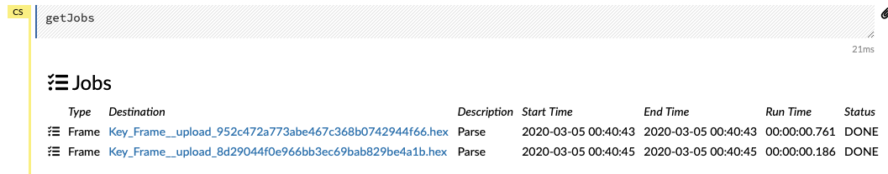
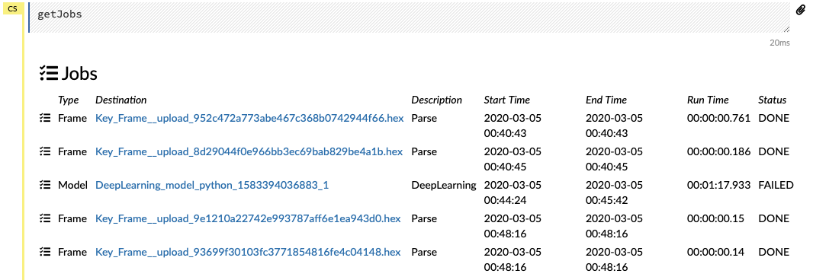
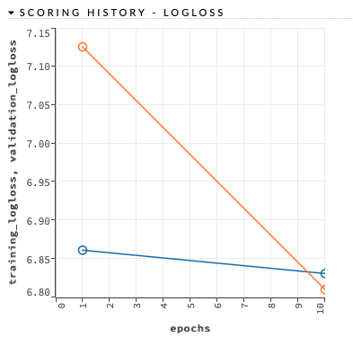
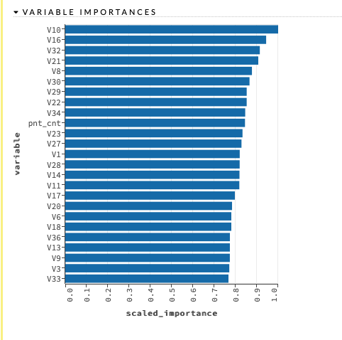
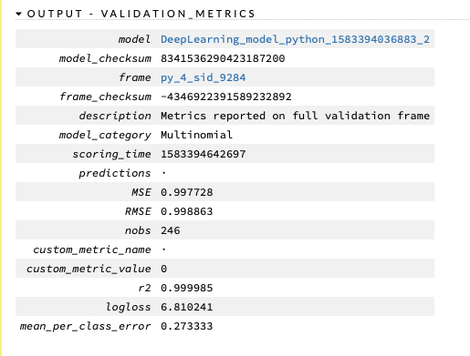
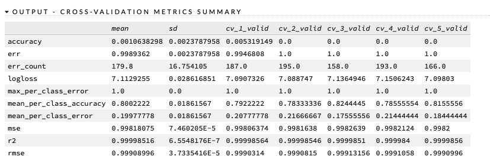
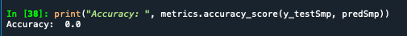

```{r, include=FALSE}
library(reticulate)
use_python("/Users/ckornafel/anaconda3/bin/python")
```

## First Attempt
The first attempt at analyzing the text included tabulating:
* Using the entire train (108,757 rows) and test1 (27,158) including padded characters. 
* The total number of characters per line (plain text adjusted for padding)
    + This figure should help match groupings of plain text and potential cipher text matches. While the largest population for both populations is 100 characters, it could highlight patterns within the lower volume groups
* The total number of capital letters included in each line. 
* The total number of lowercase letters included in each line. 
* The total number of punctuation characters
    + It was determined that punctuation was not encrypted from the plain text.
    + However, the cipher text data includes additional punctuation as they are also included in the random character padding. 
* Generalized individual character frequencies by line that are sorted: most frequent to least frequent 
    + This included 52 additional variables 
    + Columns were reordered by row to generalize actual characters (since they would be different between the two sets)
* The data sets would be analyzed using H2O DeepLearning Forward Feeding Neural Network and Sklern's SVM
    + The actual text lines were used for the H2O model as it automatically one-hot encodes categorical variables. 
    + The actual text was removed when building the SVM model
* The index value from the Train data set was added to the test data set to be used as the response variable. 
    + The correct index of matching plain/cipher text was used to determine how successful the predictions were. 
* The train set consisted of only plain text and the test set consisted only of cipher text (as structured by Kaggle)

# Examples of Data sets
```{python}
import pandas as pd
train = pd.read_csv('pred_train.csv')
test1 = pd.read_csv('pred_test1.csv')

train.head(10)
test1.head(10)
```

I also created a smaller sample data set, as the training of certain models errored out after processing too long
```{python}
train_sample = train.sample(n=900, random_state=1)
test1_sample = test1[test1['index'].isin(train_sample['index'])]

#Vlaidating that all test classes are still in train
test1_sample['index'].isin(train['index']).value_counts()
```
So the sampled test data set matches the sampled train data set cases - validating by index


## H2O Neural Network Implementation
```{r a1h2odata, echo=FALSE,  out.width = '100%'}

```
The two data frames were successfully parsed and converted to H2O frame types. 

# Issue #1
After attempting to run the full train set (108k+) lines in H2O, I discovered that H2O caps the number of classes must be under 1000. Since each plain text sentence was its own class, I needed to adjust and send the sampled data frames through instead

```{r a1h2odata2, echo=FALSE,  out.width = '100%'}

```
As we can see, the Deeplearning model failed out (due to too many classes) and smaller data frames were loaded instead. 

# Scoring History
```{r a1h2oscore1, echo=FALSE,out.width = '100%'}

```
As shown in the scoring history plot above, the log_loss for validation dropped steeply after the 1st epoch. I used only 10 epochs to keep the model from crashing, but it does not appear that using a larger number would have improved the results

# Variable Importance
```{r a1h2ovarimp1, echo=FALSE,  out.width = '100%'}

```
The model did produce a variable importance chart shows that the most critical variables were letter frequencies (V10 = 10th most frequent character) that measured the larger sentences. Given that the most common length was 100 characters, this would indicate that the longer (and more rare) strings were able to identify the pattern better than the shorter strings. It also shows that the count of punctuation was also important - given that it was already discovered that punctuation was not changed within the cipher used. 

```{r a1h2oerror1, echo=FALSE,  out.width = '100%'}

```
The final output of the model shows that it was not a very accurate and well fitted one. The MSE and RMSE were almost 1 indicating a large amount of error generated. 

# Cross Validating the Sample Model
```{r a1h2ocrossvalid1, echo=FALSE,  out.width = '100%'}

```                                                                                                                                                                                                                                                                                         

Performing the cross validation did not highlight any possible improvements. The mean accuracy was 0.11% and a corresponding error rate of almost 100%

After adjusting the number of hidden layers and decreasing the epoch, the MSE did not improve (and in some cases actually got worse)

# Best Model Predictions
```{r a1h2obestmodpred1, echo=FALSE,  out.width = '100%'}
knitr::include_graphics("a1h2obestmodpred.png")
```
After determining the "best" fit model, I used the sample test set for prediction. The MSE for the prediction achieved a horrible 99.785% error rate (worse than just guessing)


## SVM
When building the SVM model, the complete data set proved to be too large - so the sample data set was used instead. 
Prior to training the model, the data sets were encoded and scaled using StandardScaler() function. 
The gamma value was set to "auto" 
# The Results
```{r a1svmacc, echo=FALSE,  out.width = '100%'}

```
After fitting/training the model and then using the sample data sets to predict, the ending accuracy rate was determined to be 0.0 (I have never seen a score so low!)

## Conclusion
This attempt showed that, given the train/test data sets, H2O Neural Network and SVM were unable to predict cipher text (given plain text examples) with any useful accuracy. While the NN performed much better than the SVM, it still did not preform as expected. 

Thoughts: 
* I believe that using each plain text line as a separate class proved to be a large issue. Unfortunately, reducing the number of examples also decreased the amount of repetitive patterns that could be used for accurate predictions. 
    + There is a balance of using too many examples with too many classes and providing enough examples to adequately train the model. 
* Using a custom embedding scheme represented numerical patterns, but it appears that these measurements did not provide enough data for machine learning to recognize patterns. 
* The results of the SVM (0%) were surprising as I was expecting anything else given that there are distinct character length groups represented in the data set. Although, not a powerful measurement, I would have expected some benefit. 
* I believe that there is an issue of using only plain text in the training set as it does not provide corresponding cipher text examples for the model to compare. There was a large amount of manual data exploration performed before building the test/train sets that a few examples could have been included. 
    + I was able to identify a few large length matches which I could have added to the known "training" data. 
