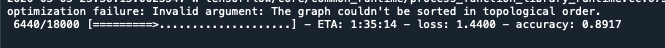
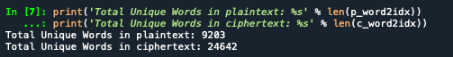
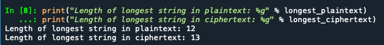
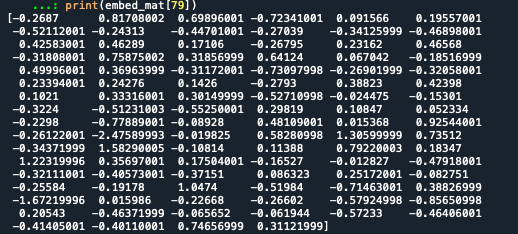
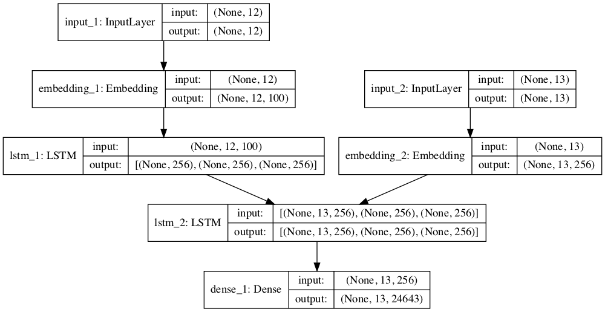
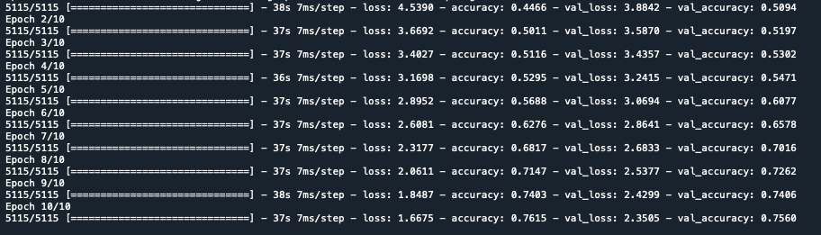
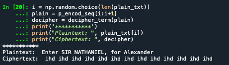
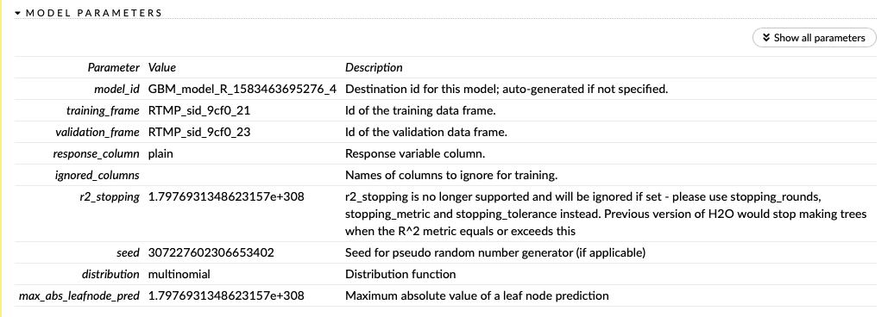
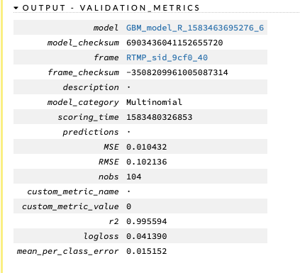
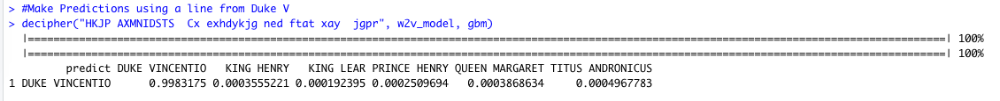

## Third and (hopefully) Final Attempt

After the abysmal results achieved during the past two attempts, I needed to reframe the problem and see if I could solve for some of the issues that I learned along the way...

Issues: 
* Too many classes
    + The problem with a rotating cipher is that each substitution changes after a certain textual event (for this one it changes after every capital letter). This produces that each cipher string/line can be unique, even if the plain text is the same - just at a different position.
* Too much / Not Enough data
    + Many of the models which used the full data set to train error ed out or failed to complete. Given the limited resources available for me, I need to reduce the volume of data that I use. However, reducing the number of examples creates an accuracy issue in that there are not enough samples to train adequately. Therefore, a balance/compromise needed to be found. 
* Textual Embedding are crucial but difficult to create
    + Because all the models require numeric representation of the text, it is crucial that I find as many meaningful measurements that can be applied to the text blocks. 
    + The H2O NN's provided variable importance when it generates a model. From this information, I was able to manually decipher the text, but also highlight the important features to include. 
    + The custom embedding that I used previously were very limited (single integer representations) which limit the prediction abilities. 

# Possible Solution: Create a language translation model
* Languages contain a large amount of independent cases (e.g. typically there are only a few exact choices for each word in another language)
  + However, there are also occurrences of "one to many" or "many to one" word/phrase correlations between different languages. This would accommodate the changes in cipher substitution.
* If I focus on the most frequent words/phrases within each (plain/cipher) then it may be possible to "translate" some of the text in each line to the degree that the remaining encrypted text can be extrapolated. 
* There are pre-defined word embedding that can be used to increase the numeric data "behind the scenes". 
    + Although I specifically chose the Shakespeare text because of its resemblance to encrypted English, there may be enough common words to exact benefit from pre-made embedding. 
    
## Tensorflow's LSTM Network
I decided to use a different Neural Network structure as H2Os Forward Feed produced the most favorable results but did not perform to expectation. Therefore, this next process will use Tensorflow with Python's Keras's front end, training a Long term Shor term Memory Network. As for the data, I removed the cipher text padding and aligned the plain text string with the "true" cipher text corresponding string. I also took the opportunity to remove punctuation as it was not encrypted (and increased the repetitive cases). 

Modified LSTM process from: https://stackabuse.com/python-for-nlp-neural-machine-translation-with-seq2seq-in-keras/, Usman Malik, 2019 - FRENCH LANGUAGE TRANSLATION

Attempting to create a translation dictionary of plain text and cipher text. This example will be using known plain text/cipher text relationships - however a similar
data set could be executed given the relative frequencies of each term in the text and matching those that are close. While the former method would likely reduce the accuracy of 
the "translation", it may offer enough correct terms to predict corresponding text relationships using by measuring their similarities. 

The first attempt used the entire, matched, data set (27k + lines). Unfortunately, the system timed out prior to completion. 

However.... 

```{r a3ltsmfull, echo=FALSE, out.width = '100%'}

```
Before the build timed out, it registered an accuracy rate of over 89% on the first epoch! 

I reduced the size of the data set, knowing that it would also impact its final ability to successfully predict some of the text. 
```{r a3ltsmdata, echo=FALSE, out.width = '100%'}

```
The reduced data set consisted of 9203 unique plain text words and almost triple that in the cipher text. The large increase indicates that the cipher text includes multiple substitutions for similar words. 
```{r a3ltsmlen, echo=FALSE, out.width = '100%'}

```
After the first few failed attempts at model completion, I discovered that this type of iteration performs better with string lengths of less than 50 characters. Therefore, I again modified the data set and re-ran the model. 

This instance also used GloVe's prebuilt 100-vector length, word embedding which was applied to the plain text examples (matched when available). 
Jeffrey Pennington, Richard Socher, and Christopher D. Manning. 2014. GloVe: Global Vectors for Word Representation. [pdf]

# GloVe's Word Embedding
```{r a3ltsemb, echo=FALSE, out.width = '100%'}

```
The 100 vector word embedding for a single plain text tokenized word. Using this information GREATLY increases the amount of numeric measurement that the network can use to fit the model. 

# Neural Network Configuration
```{r a3ltsmmap, echo=FALSE, out.width = '100%'}

```
The map of the network shows two embedding layers and two instances of LSTM. I am also using the prescribed number of nodes (256). This shows the combination of the input layer (plain text) joining with the second input layer (cipher text) and flowing into a dense network layer. 

```{r a3ltsmprog, echo=FALSE, out.width = '100%'}

```
The model did take quite a while to cycle through the 10 training epochs, but it did complete. However, as a result of limiting the data set the accuracy rate achieved was only 75.6%. Not as good as the full-set model, but a marked improvement from the 0.8% accuracy rates from the previous attempts. 

# Prediction
Now that the LSTM model has been trained, it is time to see if it can successfully "translate" plain text into the correct cipher text

```{r a3ltsmpred, echo=FALSE, out.width = '100%'}

```

The prediction output did not match the plain text string at all. However, given the repeated word (ihd), I feel that the issue lies within my code and not with the abilities of the model. 


## H2O Gradient Boost Machine with T
Given the possible success with the LSTM I decided to try H2O's Gradient Boost Machine using their new word2vec embedding function. The example of using this functionality was provided by H2O's website: https://github.com/h2oai/h2o-3/blob/master/h2o-r/demos/rdemo.word2vec.craigslistjobtitles.R (sebhrusen, 2019). 

I believe that some of the issues that I had with Tensorflows LSTM Network was a result of using the entire plain text/cipher text strings. Therefore, I modified the data set to capture only the first word of the plain text and filtered for specific Shakespeare characters. While this change will not identify specific lines of text, it will narrow down the section/block based on the speaker of the line. 
For this exercise I am using known text pairs so that I can determine the accuracy of the translation/decryption. However, if the pairs were unknown, the data set could be approximated by filtering for all capital plain and cipher words at the beginning of each line. 
Collapsing the plain text by only certain first-words does increase the repeated patterns that the machine can use for prediction. It also increases the variation of encrypted options so that searches can be performed on multiple cipher-words. 

# Modifying the Data set
```{r warning=FALSE}
library(utils)
library(stringr)
library(tidyr)
library(readr)
corp <-read_csv("/Users/ckornafel/Desktop/MSDS692 Data Science Practicum I/corp.csv", col_types = cols())

#Removing punctuation
corp <-as.data.frame(sapply(corp, function(x) as.character(gsub('[[:punct:]]+', " ",x))))

#Extracting the first two terms
corp$plain_fw <- word(corp$plain, 1,2, sep = " ")

#Reordering the dataframe columns (putting response in front) and dropping plain text column
corp <- corp[,c(3,2)]

names <- c("KING HENRY", "GLOUCESTER", "HAMLET", "BRUTUS", "QUEEN MARGARET", "MARK ANTHONY", "PORTIA", "FALSTAFF", "DUKE VINCENTIO", "KING LEAR",
           "PROSPERO", "TITUS ANDRONICUS", "IMOGEN", "ROSALIND", "MACBETH", "HELENA", "CORIOLANUS", "BIRON", "PRINCE HENRY")

#Filtering for the parts above
corp_names <- subset(corp, plain_fw %in% names) #sorting by the reduced plaintext terms

head(corp_names)
```
As the above example shows, the data set was reduced to a single plain text class word and the remaining cipher text string was included. The later will be processed through the word2vec function to identify word embedding

The GBM model was created using the base parameters and trained using a 80/20 split
```{r eval = FALSE}
#Tokenize the ciphertext
c_words <- tokenize(cipher_corp$cipher)

#Use the H2O word to vector function for word embeddings
w2v_model <- h2o.word2vec(c_words, sent_sample_rate = 0, epochs = 10) 

#Transforming the prediction into vectors to use in the GMB model
cipher_vecs <- h2o.transform(w2v_model, c_words, aggregate_method = "AVERAGE")


valid_cipher <- ! is.na(cipher_vecs$C1) #Checking for valid characters
data <- h2o.cbind(cipher_corp[valid_cipher, "plain"], cipher_vecs[valid_cipher, ])
data.split <- h2o.splitFrame(data, ratios = 0.8) #splitting the set into train and test

#Creating the GBM model 
gbm <- h2o.gbm(x = names(cipher_vecs), y = "plain",
                     training_frame = data.split[[1]], validation_frame = data.split[[2]])

#Make Predictions using a line from Duke V
deciphert("HKJP AXMNIDSTS  Cx exhdykjg ned ftat xay  jgpr", w2v_model, gbm)
```

# General (default) GBM Model Parameters
```{r a3h2ogbm, echo=FALSE, out.width = '100%'}

```

# General (default) GBM Model Parameters
```{r a3h2ogbmacc, echo=FALSE, out.width = '70%'}

```

With the updated data set and the vectorized cipher tokens, the GBM model performed very well with a low MSE rate. This is the best performance noted to date. 

# Testing the Prediction Capability
I randomly selected a cipher string that corresponded with Duke Vincentio and attempted to see if the GBM model could successfully identify the speaker/part of the Shakespeare Play
```{r a3h2opred, echo=FALSE, out.width = '100%'}

```
As the output shows, the model did identify the correct plain text speaker/part of the play corresponding to the cipher text entered. Additionally, the model provided the top six possible matches with a numeric indication of their likelihood.

# H2O Conclusion
The final implementation of H2O GBM using the word2vec function required very little code yet produced the best results from this project. I do realize; however, that most of the benefit was derived from the greatly reduced data set (focusing only on certain first plain text words). This leads me to believe that multi-classification, using neural networks is a potential tool for cipher text encryption. However, it would require more computational resources than an average college student has access to. 


## Overall Thoughts
Many of the machine learning models were not able to successfully identify patterns within the encrypted text, given the resources available. However, there were some “glimmers” of hope with the use of neural networks. I believe that increasing the size of the network (adding more hidden layers) and expanding the data used could result in better performance. Building a viable fully homomorphic encryption scheme, in which the machine recognizes encoded data and is able to process it without decryption would require large, complex neural networks. 

It was shown that the type of data is very important when it comes to building a successful machine learning model. I found that modifying the text into a custom embedding scheme took a lot of effort but yielded very little results. Additionally, the fact that I manually uncovered the type of cipher being used for the challenge well before achieving any form of automated success, demonstrates that current (inexpensive) machine learning techniques are not cost effective for this type of project. However, the process did produce useful information, e.g. variable importance, which did assist with determining which character types I should focus on.