```{r, include=FALSE}
library(reticulate)
use_python("/Users/ckornafel/anaconda3/bin/python")
```

## Second Attempt
After the abysmal performance achieved using the first modified data sets (attribute counts, plain text-only training set), I decided to take a different approach. I learned that I needed fewer classes than each row and I should attempt to include cipher text examples in the training set. Another issue that I identified was the random component of the cipher text character padding. In an effort to remedy some of these issues, I began to focus on the individual words within each string as opposed to viewing the entire string. 

While I was experimenting with the original data, I was able to determine the padding scheme used for the level 1 encryption. Each cipher text line split the number of random characters pre and post the true encrypted string (i.e. the actual Shakespeare text was located in the middle of the encrypted string). I made the decision to remove the padding so that I could expose the actual encryption pattern which would hopefully improve prediction accuracy. 
Additionally, I did notice that the encryption scheme used was a rotating poly alphabetic substitution which changed after every capital letter (similar to a Caesar Shift cipher). This highlights that manual effort achieved more than using the machine learning techniques already. However, I attempted to recreate the information that I used in breaking the encryption method. 

The new approach: 
* Listed individual words of plain text with their corresponding encrypted text
    + This processed greatly reduced the amount of classes due to the repetition of words throughout the Shakespeare text. However, there were still over 1000 combination of alpha/punctuation so I did cap the training size to 1000. 
* Words were separated via space characters (as identified in the data exploration section). 
    + Since both plain and cipher texts used the same spacing scheme, it produced equal number of word pairs. 
* All punctuation was included since it these characters represented similarities between each pair. 
* To further reduce file size, the total number of occurrences for each plain/cipher pair within the data sets was added. 
* The longest word/punctuation combination was 48 characters long.
    + This produced 48 individual columns for each word - shorter words had 0's filled in for the missing characters (I was adding my own padding!)
* The majority of the columns listed individual characters were of chr-typed that would be one-hot encoded prior to training the various models. 
* The models used include: Decision Tree, SVM, KNN, and H2O's Forward Feed Neural Network. 

# Data set Sample
```{python}
import pandas as pd
ltr = pd.read_csv('/Users/ckornafel/Desktop/MSDS692 Data Science Practicum I/cipher_ltr.csv')
ltr = ltr.fillna(0) #Filling in the missing values with a 0

ltr.head()
```

# One-Hot Encoding the Sample Set
```{python}
SAMPLE_SIZE = 1000
ltr_samp = ltr.sample(n=SAMPLE_SIZE) #Obtaining a random sample of 1000 items

p_target_samp = ltr_samp['plainwd'].astype('category') #coding the response variable
ltr_samp = ltr_samp.drop('plainwd', axis = 1) #Removing response from feature set

one_hot_samp = pd.get_dummies(ltr_samp) #One hot encoding the features

one_hot_samp.head()
```

As the example shows above, each of the character variables have been expanded based on their values to 598 columns. 

# Breaking the set into Train/Test and Scaling the Values
```{python}
from sklearn.preprocessing import StandardScaler, LabelEncoder
from sklearn.model_selection import train_test_split

#Identifying feature and target
features_samp = one_hot_samp
target_samp = p_target_samp

#Sample Size Data
x_samp_train, x_samp_test, y_samp_train, y_samp_test = train_test_split(features_samp, target_samp, random_state = 0)

#Scaling the datasets
scaler1 = StandardScaler()
scaler1.fit(x_samp_train)
x_samp_train = scaler1.transform(x_samp_train)
x_samp_test = scaler1.transform(x_samp_test)

```
```{r a2scaler, echo=FALSE, out.width = '50%', fig.align="center"}
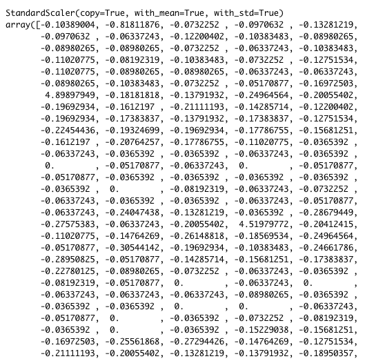
```


While not as sophisticated as word-type embedding, the one-hot encoding of scaled letter frequencies and positions does resemble a corpus-type format. My hope is that these vector values can provide enough information for the ML model to determine the cipher. 


## Decision Tree
After training/testing a decision tree with a max depth of 100, using the full data set, I found that it took a lot of time to process (too much for RMarkdown) and did not produce any viable results. For this example, I am using the reduced sample set and allowing the model to expand to whatever depth it needs to create pure leaves.

```{r include=FALSE}
library(pander)
panderOptions('digits', 5)
panderOptions('round', 5)
panderOptions('keep.trailing.zeros', TRUE)
```

```{python}
#Decision Tree
from sklearn.tree import DecisionTreeClassifier 
from sklearn.metrics import classification_report

##Reducing the dataset size so I can increase depth
#Creating the model without max depth value - this will fully extend each leaf
s_tree_mod = DecisionTreeClassifier()
s_tree_mod.fit(x_samp_train, y_samp_train)

s_tree_pred = s_tree_mod.predict(x_samp_test)

#Classification Report
s_tree_cr = classification_report(y_samp_test, s_tree_pred, output_dict=True)
acc = s_tree_cr["accuracy"]
print( "Accuracy of Decision Tree: ", acc)
print( "Precision of Decision Tree: ", s_tree_cr["macro avg"]["precision"])
```
The decision tree produced 0.4% accuracy and a precision of 0.25% precision. So this model did not produce accurate or repeatable predictions. However, these scores are marginally better than the previous attempt. Perhaps other models will yield better results. 


## KNN
Using KNN is popular for recommender systems that group similar items together based on their attributes. Hopefully, this model can find enough similarities within the data for better predictions than the decision tree.

```{python eval = FALSE}
#KNN
from sklearn.neighbors import KNeighborsClassifier 
import numpy as np

#Finding the K with the lowest error
error = []
for i in range(1,50):
    knn = KNeighborsClassifier(n_neighbors = i)
    knn.fit(x_samp_train, y_samp_train)
    pred_i = knn.predict(x_samp_test)
    error.append(np.mean(pred_i != y_samp_test))
```

# Error Rates

```{r a2knneror, echo=FALSE, out.width = '40%', fig.align="center"}
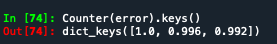
```

The KNN error provided a few models that had a slightly less error rate than the other processes, but overall poor results. However, I went ahead and attempted some predictions

# Predictions
```{python}
#KNN
from sklearn.neighbors import KNeighborsClassifier 
NEIGHBORS = 100
s_knn_mod = KNeighborsClassifier(n_neighbors = NEIGHBORS)
s_knn_mod.fit(x_samp_train, y_samp_train)
```
```{python eval = FALSE}
#Determining Accuracy
s_knn_mod_accuracy = s_knn_mod.score(x_samp_test,y_samp_test)
#print("KNN Accuracy: ", s_knn_mod_accuracy)

#Predict
s_knn_pred = s_knn_mod.predict(x_samp_test)

knn_cr = classification_report(y_samp_test, s_knn_pred, output_dict=True)

```
```{r a2knnacc, echo=FALSE, out.width = '60%', fig.align="center"}
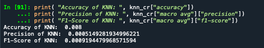
```
The accuracy did improve from the Decision Tree model, from 0.4% to 0.8% but the precision of the predictions dropped considerable. This would indicate that the improved accuracy (if one could call it improved) would not be consistently produced. The F1 score indicates that the true positives were very low in the prediction results so it appears that the model was better at predicting the negative cases. The likely source would be the high number of cases within the testing frame. 

# KNN Conclusion 
Again, using a random sample of the data set, I feel, is a drawback when using this model. Using a reduced sample allows the model to fit within a acceptable period of time (before the IDE times out) and it reduces the overall classes; however, it limits the available examples that could help precision and overall accuracy. 
The accuracy score was better than expected at this stage (although still horrible) but the corresponding low Precision and F1-Score reduce the overall improvement since it implies that lucky chance played a part. 

## SVM
The next model that I used is the support vector machine model which I also used with the previous data set. The repeated measurement could highlight if the modifications I performed on the train/test sets added benefit. 

I attempted two kernel shapes with the data, linear and ovo. The One vs One (ovo) kernel is specific for multiclass classification which trains data based on the number of classes available. 

The first linear SVM model performed as well as the previous one:

```{r a2svmlinacc, echo=FALSE,  out.width = '30%', fig.align="center"}
knitr::include_graphics("a2svmlinacc.png")
```

However, the One vs. One model showed a little promise: 

```{r a2svmovoacc, echo=FALSE, out.width = '30%', fig.align="center"}

```

Perhaps with some fine tuning the model would improve its performance

A grid search was performed using the kernels: linear, rbf, poly, and ovo with C values ranging from 1 to 10. However, the infrequent classes (there was a class with only one member) created issues with cross validating more than cv = 2. 
```{python eval=FALSE}
svc= SVC()
param = {'kernel':('linear', 'rbf', 'poly'), 'C': [1,10]}
grid = GridSearchCV(svc,param, cv=2)
```

Unfortunately, the limited grid search showed that the linear kernel and a C value of 1 was the best fit. Since the OvO kernel already yielded the "best" results, I used that model for prediction. 

```{r a2svmovopred, echo=FALSE, out.width = '40%', fig.align="center"}
knitr::include_graphics("a2svmovopred.png")
```
We can see that the accuracy remained the same with predictions. However, the precision and F1-Scores were pretty bad. 

## SVM Conclusion 
I feel that using a reduced sample data set also played a role in the poor performance. Perhaps if I manipulated the data set to include only the most frequent cases it would have performed better. 
The SVM OvO model did perform better than the previous attempt at using SVM, which would indicate that the kernel shape is important for this type of fit. 

## H2O Forward Feed Neural Network
I used the H2O NN with the previous data set and only had to reduce the data size to accommodate its 1000 case maximum. Therefore, it was able to utilize more data in determining and recognizing text patterns. For this attempt (focusing on words instead of the entire string), the number of cases has already been reduced. This is further reduced to create the train/validation sets - so no data is "technically" omitted. Additionally, NN's require a lot of training data to generate results, so this adjustment should yield better performance. 
```{r a2sh2odataload, echo=FALSE, out.width = '70%', fig.align="center"}
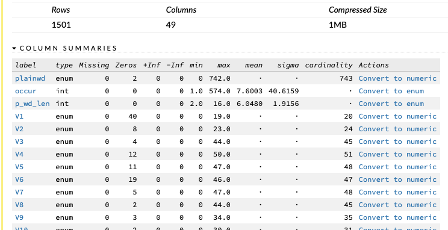
```

As we can see, the data set that was loaded into H2O was successfully parsed and contained 1501 rows with 49 columns. At this stage, the V1.. variables are stored as factors and will automatically be one-hot-encoded. 

The H2O model constructed:

```{r a2sh2omod1, echo=FALSE, out.width = '40%', fig.align="center"}
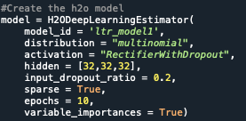
```
The model was constructed with a small hidden layer to ensure completion and reduce running time, as well as using only 10 epochs. 

However, the results were very similar to the previous attempt

```{r a2sh2omod1res, echo=FALSE, out.width = '30%', fig.align="center"}
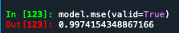
```

This model was then cross-fold validated in an attempt to improve its performance. However, the number of cross-folds had to remain within the number of available cases and was set to nfolds = 3. This lower number was not expected to greatly improve results - which came true

```{r a2h2ocvmse, echo=FALSE, out.width = '30%', fig.align="center"}
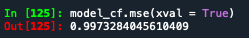
```
The cross-validation only yielded a reduction of 0.0012 in MSE. Therefore, I decided to perform a grid search to discover any parameter adjustments that could help improve results. 

```{r a2h2ogridparam, echo=FALSE, out.width = '50%', fig.align="center"}
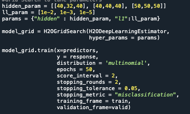
```

For the grid search, I used multiple hidden layers (although still on the small side to accommodate computer resources). I also introduced several L1 values which helps improve generalization (given the low frequency of multiple cases). 

```{r a2h2ogridout, echo=FALSE, out.width = '100%'}
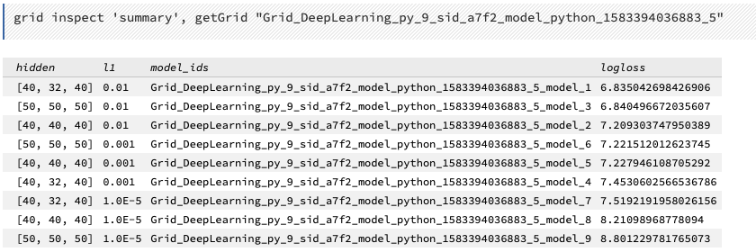
```

The results of the grid search yielded models which continually increased its logloss values. As a result, I focused only on the first model with the lowest logloss. 

```{r a2h2ogridlogloss, echo=FALSE, out.width = '40%', fig.align="center"}
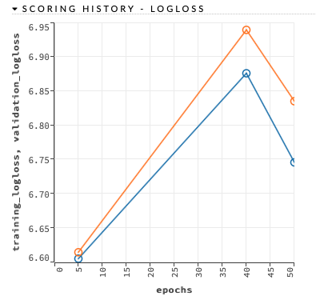
```
We can see from the above plot that the performance of the "best" model increased for every epoch prior to 40. Given that I was only using 10 epochs for the initial model, it could indicate that this value needs increasing

The MSE did not show  improvement for any of the possible models from the grid search. Therefore, I used the web interface to develop a more complex model (using many of the defaults). One of the benefits of using the web portal is that the models build much faster and with fewer computer resources. This allowed me to increase the size of the network 

```{r a2h2owebmod, echo=FALSE, out.width = '100%'}
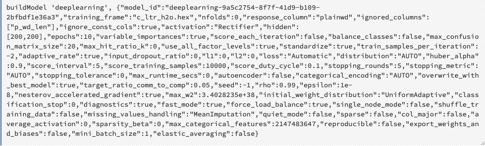
```

As the above model shows, I was able to increase the hidden layer to 200, 200 nodes.

```{r a2h2owebper, echo=FALSE, out.width = '60%', fig.align="center"}
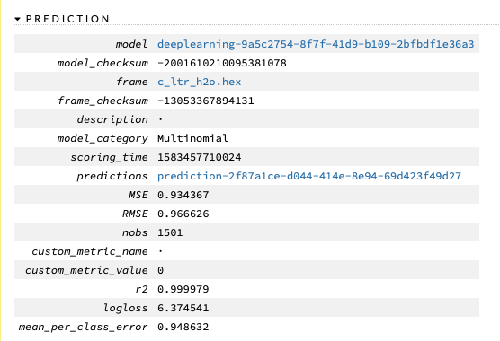
```

The web-created model showed considerable improvement from the smaller network. This infers that large hidden layers are most likely necessary for this type of endeavor. 

## H2O Conclusion
Again, the neural network showed the most promise with this task when compared with the other models used in this iteration of the project. However, it was necessary to use the web portal to expand the neural network and capitalize on the power of hidden layers. 
I still feel that the lack of samples did have a negative impact on the overall performance. 
